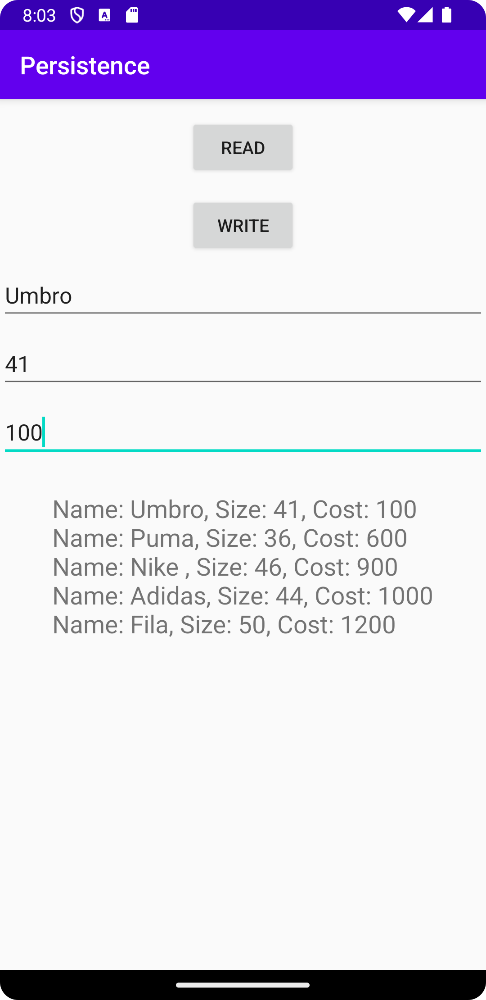

# Rapport
För den sjunde uppgiften så skapades det två java klasser, DatabaseTables och DatabaseHelper. Den ena har man skapat
konstanter för skapandet och förstörelsen av tabellen, fast det är i den andra klassen som man skapar databasen. 
Sedan skapar man två knappar, read och write, där den ena lägger till en ny rad och den andra tar fram alla rader genom TextView:n.
I MainActivity skapar onclicklisteners på knapparna som ska göra det som nämndes innan.

```
        writeBtn.setOnClickListener(new View.OnClickListener() {
            @Override
            public void onClick(View view) {
                String name = nameEditText.getText().toString();
                int height = Integer.parseInt(heightEditText.getText().toString());
                String id = idEditText.getText().toString();
                addMountain(name, height, id);
                textDisplay.setText("Row inserted to database.");
            }
        });

        readBtn.setOnClickListener(new View.OnClickListener() {
            @Override
            public void onClick(View v) {
                List<String> mountainList = getMountains();
                StringBuilder stringBuilder = new StringBuilder();
                for (String mountain : mountainList) {
                    stringBuilder.append(mountain).append("\n");
                }
                textDisplay.setText(stringBuilder.toString());
            }
        });
        
        static class Mountain {

        static final String TABLE_NAME = "mountain";
        static final String COLUMN_NAME_ID = "id";
        static final String COLUMN_NAME_NAME = "name";
        static final String COLUMN_NAME_HEIGHT = "height";

    }

    static final String SQL_CREATE_TABLE_MOUNTAIN =
            // "CREATE TABLE mountain (id INTEGER PRIMARY KEY, name TEXT, height INT)"
            "CREATE TABLE " + Mountain.TABLE_NAME + " (" +
                    Mountain.COLUMN_NAME_ID + " INTEGER PRIMARY KEY," +
                    Mountain.COLUMN_NAME_NAME + " TEXT," +
                    Mountain.COLUMN_NAME_HEIGHT + " INT)";
```


